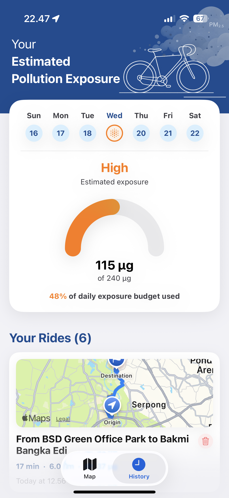
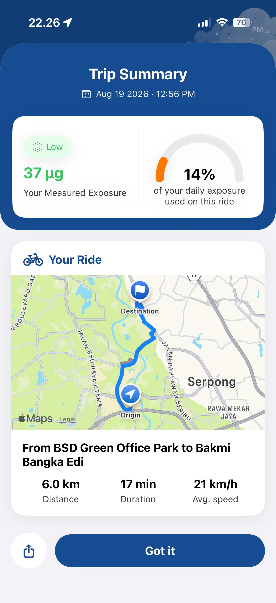
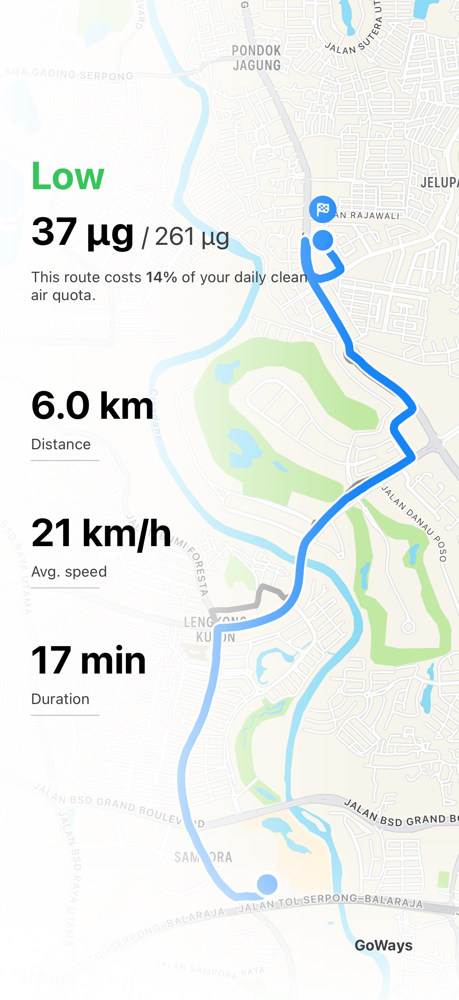

# GoWays 🚴‍♂️💨

**Google Maps gives you the fastest route. GoWays gives you the one that hurts you the least.**

GoWays is an iOS navigation app built for cyclists in Jabodetabek (Greater Jakarta) that ranks routes by **estimated PM2.5 exposure dose** — not travel time — then measures your actual dose while you ride.

---

## 🎬 App Overview

  
  
  

  
  

---

## 🧠 Why GoWays?

Jakarta has some of the worst air quality of any major city, and cyclists take the brunt of it — breathing harder, more often, right next to the source of the pollution. Every navigation app out there optimizes for **time**. None of them ask how much of that air actually ends up in your lungs.

GoWays flips that:

- 🗺️ **Planning Mode** — before you set off, GoWays compares up to 3 alternative routes and ranks them by estimated exposure dose, not distance or travel time.
- 🚴 **Live Ride Mode** — once you start riding, GoWays measures your actual dose in real time: segment-by-segment duration from GPS, minute ventilation derived from your heart rate (Apple Watch), and PM2.5 concentration refreshed every hour.

The division of labor is deliberate: a CoreML model produces the absolute dose number per location cluster, while a deterministic formula layer handles the ranking — combining road type, greenery, and actual travel time.

---

## ✨ Features

- **Exposure-dose-based route ranking**, not just distance/time — powered by OpenRouteService (cycling profile) + CoreML PM2.5 prediction + Jabodetabek road type & greenery data.
- **Live dose tracking** during the ride — GPS map-matching per ~200m segment, anti-flapping at segment boundaries, incremental dose accumulation.
- **Heart-rate-based ventilation rate** — with an Apple Watch paired, dose is computed from your actual breathing rate (Greenwald et al. 2019), not a constant.
- **Exposure heatmap** along the route, using ISPU / Indonesian Ministry of Environment (Permen LHK 14/2020) thresholds.
- **Post-ride summary** — actual dose, per-segment breakdown, ride history.
- Honest about uncertainty: route pairs with similar exposure are flagged as "equivalent" instead of being forced apart to look smarter.

---

## 🏗️ Tech Stack

<table>
<tr>
<th align="left">📱 iOS</th>
<th align="left">🧠 ML</th>
<th align="left">⚙️ Backend</th>
<th align="left">🌐 API External</th>
</tr>
<tr>
<td valign="top">

</td>
<td valign="top">

</td>
<td valign="top">

</td>
<td valign="top">

</td>
</tr>
</table>

---

## ⚠️ Known limitations

- CAMS (the underlying PM2.5 data source) has coarse resolution — on short routes, the ML model's contribution to ranking can approach zero, with the formula layer (road type, greenery) doing the heavy lifting.
- The model and road data only cover **Jabodetabek**. Anything outside that is extrapolation.
- Planning mode numbers are **estimates**, not measurements — that's why the UI shows ranges/categories rather than precise figures.

---

## 👥 Team Sweetseventeen

Built by:

- **Revan Ferdinand**
- **Jonathan Basuki**
- **Marvellino Christian Sanjoto**
- **Devi Jayanti Sujata**
- **Ananta Ghaisani**

---

Your breath is worth something. Your route should know that. 🌬️

